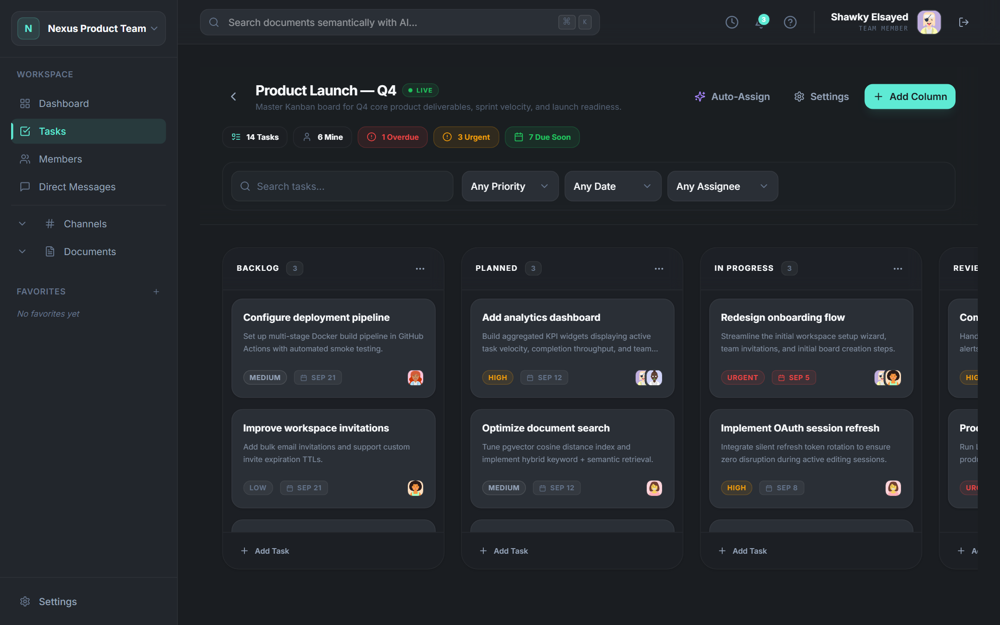
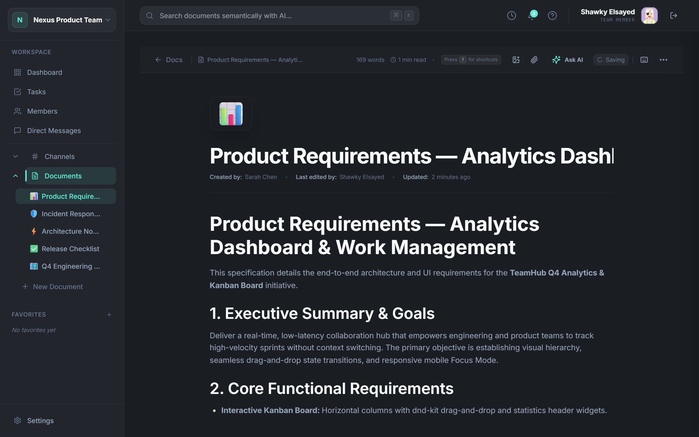
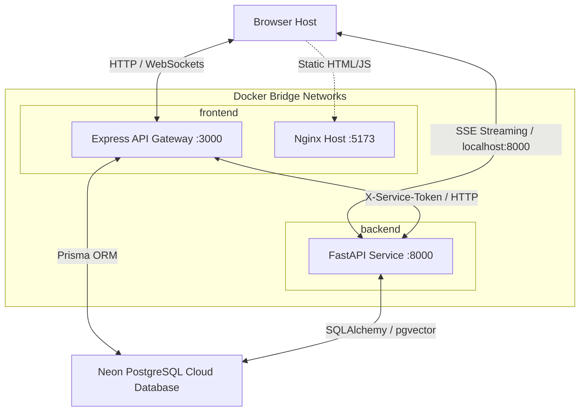
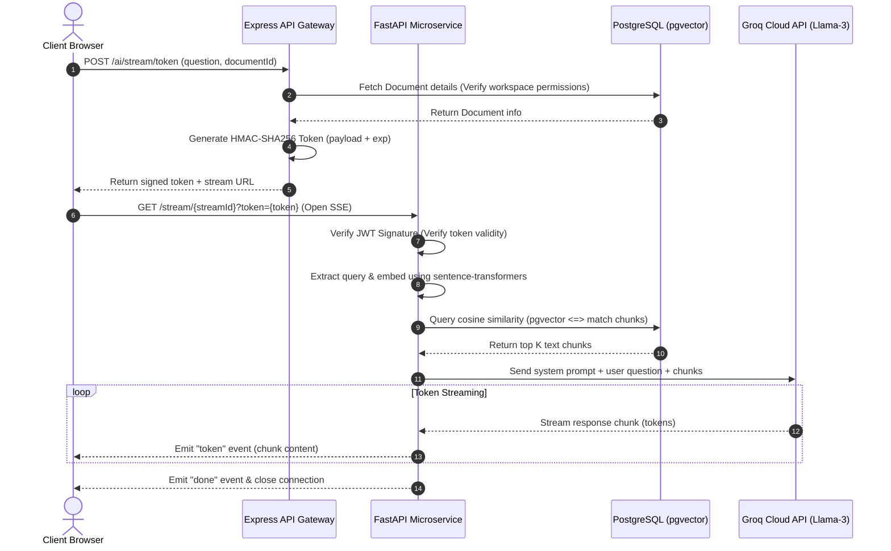
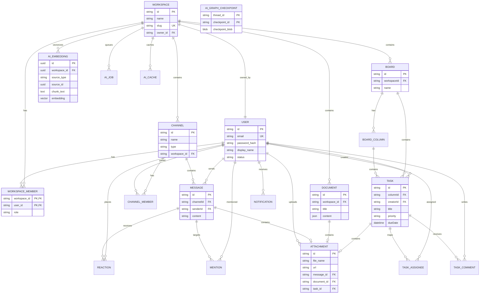

# TeamHub — Enterprise-Grade Workspace Collaboration Platform

<p align="center">
  
  
  
  
  
  
  
  
  
  
  
  
  
  
</p>

<p align="center">
  <strong>🔗 Live Deployment: <a href="https://teamhub-one.vercel.app/login">https://teamhub-one.vercel.app</a></strong> &nbsp;•&nbsp;
  <strong>🎬 <a href="artifacts/demo/video/teamhub-demo-cv.mp4">Watch Walkthrough (1080p MP4 — 50s)</a></strong> &nbsp;•&nbsp;
  <strong>⚡ <a href="artifacts/demo/video/teamhub-demo-short.mp4">Quick Cut (30s)</a></strong>
</p>

<p align="center">
  <a href="artifacts/demo/video/teamhub-demo-cv.mp4">
    
  </a>
</p>

TeamHub is an enterprise-grade, containerized workspace collaboration platform architected for agile engineering teams. It integrates sub-50ms real-time task management (Kanban), threaded communication channels, TipTap rich-text documentation, and state-machine AI agents with semantic vector search.

---

## 📖 Table of Contents
1. [🎬 Video Walkthrough & Demos](#-video-walkthrough--demos)
2. [⚡ Work Management Spotlight (Shawky Elsayed)](#-work-management-spotlight-shawky-elsayed)
3. [📸 UI & Architecture Gallery](#-ui--architecture-gallery)
4. [🧪 Reproducible Demo Quickstart](#-reproducible-demo-quickstart)
5. [🚀 Key Features](#-key-features)
6. [🛠️ Tech Stack](#️-tech-stack)
7. [📁 Folder Structure](#-folder-structure)
8. [🏗️ System Architecture](#️-system-architecture)
9. [⚙️ Environment Variables](#️-environment-variables)
10. [🏃 Running Locally (No Docker)](#-running-locally-no-docker)
11. [🐳 Running with Docker (Production/Staging)](#-running-with-docker-productionstaging)
12. [🔐 Seeded Demo Accounts & Credentials](#-seeded-demo-accounts--credentials)
13. [🔌 API Endpoints Summary](#-api-endpoints-summary)
14. [👥 Developer Experience & Contribution](#-developer-experience--contribution)
15. [👥 Team Distribution & Credits](#-team-distribution--credits)

---

## 🎬 Video Walkthrough & Demos

The demonstration video showcases a continuous, zero-freeze walkthrough recorded at 1080p 60fps with fluid cursor motion, sub-50ms optimistic UI interactions, and client-side single-page navigation:

| Deliverable | Format / Resolution | Duration | File Size | Description & Direct Links |
| :--- | :--- | :--- | :--- | :--- |
| **Full Portfolio Walkthrough** | 1080p H.264 (`+faststart`) | **50.77s** | **4.17 MB** | **[▶️ View teamhub-demo-cv.mp4](artifacts/demo/video/teamhub-demo-cv.mp4)**<br/>Complete flow: Executive Dashboard → Work Management Kanban → Task Detail Drawer & Comments → Priority Filters → Realtime Channels → TipTap Docs → RBAC Directory. |
| **High-Impact Social Cut** | 1080p H.264 (`+faststart`) | **30.00s** | **2.31 MB** | **[▶️ View teamhub-demo-short.mp4](artifacts/demo/video/teamhub-demo-short.mp4)**<br/>Snappy 30-second cut optimized for LinkedIn posts, technical recruiter reviews, and fast mobile previews. |

> 📄 **Technical Verification & Metrics**: Complete timing breakdowns, frame-by-frame audits, and route mappings are documented in the [Demo Manifest](artifacts/demo/manifests/DEMO_MANIFEST.md).

---

## ⚡ Work Management Spotlight (Shawky Elsayed)

**Feature Architect & Lead**: **Shawky Elsayed**  
**Core Responsibility**: Real-Time Kanban Board, Task Lifecycle Engine, Filtering System & Responsive Mobile Architecture.

<p align="center">
  
  
</p>

### Key Engineering Decisions & Innovations

1. **Optimistic Multi-Column Drag-and-Drop (`@dnd-kit/core` & `@dnd-kit/sortable`)**:
   - Architected responsive 5-column sprint workflows (`Backlog`, `Planned`, `In Progress`, `Review`, `Done`).
   - Implemented sub-50ms optimistic state reconciliation: task card reordering renders instantly in the DOM while queuing asynchronous API synchronization.
   - Designed automatic drag-locks when active filter or search queries are applied to prevent corrupted index mutations.
2. **Deep-Linked Task Drawer (`?task=<uuid>`)**:
   - Synchronized drawer state directly with URL query parameters via React Router.
   - Allows teammates to share direct links to individual task discussions, preserving context on page reloads and browser history traversals (`Back`/`Forward`).
3. **Deadlines & Overdue Visual State Machine**:
   - Dynamic date-computation engine that evaluates task due dates against client/server UTC clocks.
   - Highlights delayed tasks with high-visibility red badge indicators and urgency flags without requiring manual state toggles.
4. **Mobile-First "Focus Mode"**:
   - Solved the common UX bottleneck of cramped horizontal scrolling on mobile viewports (390×844).
   - Designed a single-column tabbed Focus Mode enabling developers on mobile devices to switch between sprint columns smoothly with swipe-friendly touch targets.
5. **Real-Time Collaborative Synchronization**:
   - Powered by Socket.IO event listeners (`TASK_UPDATED`, `TASK_MOVED`, `TASK_COMMENT_ADDED`), broadcasting updates across concurrent active workspace sessions.

---

## 📸 UI & Architecture Gallery

A curated preview from the **32 high-resolution screenshots** captured across desktop (1440×900 @ 1.5x DPR) and mobile (390×844) viewports:

| View | Desktop Capture | Key Capabilities |
| :--- | :--- | :--- |
| **Kanban Sprint Board** | <a href="artifacts/demo/screenshots/18-kanban-rich-board.png"></a> | Multi-column drag-and-drop, priority badges, assignee avatars, sprint metrics. |
| **Task Detail Drawer** | <a href="artifacts/demo/screenshots/19-task-detail-drawer.png"></a> | Sliding panel, live comments thread, priority selectors, URL sync (`?task=id`). |
| **Overdue Task Warnings** | <a href="artifacts/demo/screenshots/24-board-overdue-state.png"></a> | Red overdue alert badges, deadline countdowns, and urgent triage states. |
| **Realtime Team Channels** | <a href="artifacts/demo/screenshots/09-channel-conversation.png"></a> | Socket.IO messaging, emoji reactions, code block syntax highlighting. |
| **TipTap Document Editor** | <a href="artifacts/demo/screenshots/13-document-editor.png"></a> | Collaborative rich-text editor with markdown parsing and debounced auto-save. |
| **Executive Dashboard** | <a href="artifacts/demo/screenshots/04-dashboard.png"></a> | Sprint velocity meter, team capacity tracking, active priorities, and live feed. |
| **Mobile Focus Mode** | <a href="artifacts/demo/screenshots/27-board-mobile-focus-mode.png"></a> | Single-column tabbed navigation tailored for mobile viewports (390×844). |

> 📁 **Full Screenshot Catalog**: Browse all 32 captures and architectural breakdowns in [HERO_SCREENSHOTS.md](artifacts/demo/manifests/HERO_SCREENSHOTS.md).

---

## 🧪 Reproducible Demo Quickstart

Evaluate the full platform locally in under 60 seconds with self-contained seed data:

```bash
# 1. Start isolated PostgreSQL container with pgvector (Port 5435)
docker run -d --name teamhub-postgres -e POSTGRES_USER=postgres -e POSTGRES_PASSWORD=postgres -e POSTGRES_DB=teamhub -p 5435:5432 pgvector/pgvector:pg16

# 2. Seed realistic demo data (Shawky Elsayed, Q4 Sprint Board, overdue tasks, channels)
npx tsx apps/api/prisma/demo-seed.ts

# 3. Launch development servers
pnpm dev
```

Open `http://localhost:5173` and log in immediately using the seeded credentials below.

---

## 🚀 Key Features

### 🔐 User & Security Features
* **Unified Auth System**: Secure authentication utilizing password hashing via `bcrypt` and JWT session management. Features a stateless short-lived `access_token` and secure `httpOnly` cookie-stored `refresh_token` with automatic Token Rotation to defend against replay attacks.
* **Granular Role-Based Access Control (RBAC)**: Fine-grained workspace permission checking (Owner, Admin, Member, Guest) dynamically restricting editing rights on documents, channel management, and task updates.
* **Premium Profile Settings**: Flexible workspace membership directories displaying display names, statuses, and custom abstract avatars generated via DiceBear APIs.

### 📋 Real-Time Work Management (Kanban Boards)
* **Live Interactive Kanban**: Create project boards to separate departments or sprints. Column layouts support vertical scrolling on desktop, custom drag-and-drop actions, and a mobile tabbed "Focus Mode" to prevent cramped viewports.
* **Deep-Linked Task Cards**: Task details open in a right-side sliding panel and automatically append the task ID to the browser URL (e.g. `?task=uuid`), allowing direct link sharing.
* **Rich Task Metadata & Colleague Discussion**: Set due dates (with red overdue highlight states), priorities (Low, Medium, High, Urgent), and multiple user assignees. Discuss deliverables via real-time threaded message streams.
* **Smart Filter & Commands Header**: Instantly search tasks by text or isolate items by priority, assignment, or dates (Today, This Week, Overdue) with drag-and-drop locks when filters are active.

### 💬 Workspace Messaging & Channels
* **Dynamic Chat Rooms**: Supports creating public channels (which users can join/leave directly), private channels, and direct messages (DMs).
* **Optimistic UI & WebSocket Sync**: Socket.io broadcasting ensures messages, typing indicators, and emoji reactions update instantly. Message delivery displays immediately in the viewport while database writes execute in the background.

### 📄 Document Hub & Rich Text Editor
* **TipTap Collaborative Editor**: Interactive document workspace supporting header hierarchies, nested formatting, code snippets, lists, checkboxes, and links.
* **Debounced Auto-Save**: Seamless background synchronization saves content modifications as you write to prevent data loss.
* **Exporting Frameworks**: Exporters include a recursive JSON-to-Markdown parser producing clean GitHub-Flavored Markdown and a client-side print-friendly PDF engine which overrides dark-mode settings to produce light, clean documents.

### 🤖 State Machine AI Agents (FastAPI & LangGraph)
* **Retrieval-Augmented Generation (RAG)**: An isolated FastAPI microservice processes document text, splits content into overlapping chunks, computes embeddings via HuggingFace `all-MiniLM-L6-v2`, and stores them in PostgreSQL using the `pgvector` extension.
* **Document Q&A & Summaries**: Stream answers grounded in your workspace database or run summaries (Short, Medium, Long) with low-latency Server-Sent Events (SSE).
* **Document-to-Tasks Extraction Agent**: Extracts draft checklist items from document nodes, flags vague timelines/descriptions, prompts clarification workflows via LangGraph `interrupt()`, and maps workspace members automatically.
* **Workload-Constrained Auto-Assignment Agent**: Automatically schedules unassigned tasks by calculating member workloads (Low: 1pt, Urgent: 5pts), runs optimization loops to balance workloads, and renders current vs. proposed point capacity charts for approval.
* **Global Command Palette (`Ctrl + K`)**: Summon a workspace-wide search console to perform semantic queries across all doc libraries.

---

## 🛠️ Tech Stack

### Frontend Client
* **Core Framework**: React (Vite SPA)
* **Styling & Icons**: Tailwind CSS, Lucide Icons
* **Rich Text Editing**: TipTap Editor (ProseMirror-based)
* **Real-time & Sync**: TanStack Query v5, Socket.io-client, Zustand (Global state persistence)
* **Exporting Tools**: `html2pdf.js`

### Backend Gateway
* **Core Engine**: Node.js, Express.js (TypeScript)
* **ORM & Database**: Prisma Client v7, PostgreSQL
* **Security & Routing**: Helmet, `cookie-parser`, `bcrypt`, JSON Web Tokens
* **Real-time Server**: Socket.io

### AI Microservice
* **Framework**: FastAPI (Python 3.11)
* **Database Interface**: SQLAlchemy, Asyncpg, Alembic migrations
* **AI & Graph Agent Engine**: LangGraph, LangChain, Groq Cloud API (Llama models)
* **Embeddings & Search**: HuggingFace SentenceTransformers (`all-MiniLM-L6-v2`), PostgreSQL `pgvector`

---

## 📁 Folder Structure

```
teamhub/
├── apps/
│   ├── ai/                  # Python FastAPI Microservice (LangGraph, Alembic, Embeddings)
│   │   ├── app/             # Routers, schemas, agents, and embedding pipelines
│   │   └── alembic/         # Database migration versions
│   ├── api/                 # Node.js/Express API Gateway (Auth, WebSockets, Prisma)
│   │   ├── prisma/          # Schema definitions, database seed files, and migrations
│   │   └── src/             # Express features, routers, middleware, and controllers
│   └── web/                 # React + Vite Frontend Client
│       └── src/             # Components, hooks, Zustand stores, and routing
├── packages/
│   ├── shared/              # Centralized workspace (Zod schemas, shared TypeScript types)
│   ├── eslint-config/       # ESLint configurations
│   └── typescript-config/   # Centralized TSConfigs (base.json, etc.)
├── docs/                    # Individual feature documentation files
├── docker-compose.yml       # Docker orchestrator configuration
├── pnpm-workspace.yaml      # Monorepo workspaces definition
└── turbo.json               # Turborepo task pipeline management
```

---

## 🏗️ System Architecture

TeamHub uses an API Gateway architecture with isolated networks to guarantee security:

### Network Topology & Request Routing


### AI RAG & EventSource Streaming Sequence
This sequence details how the EventSource streaming query resolves from authentication, chunk matching, to token delivery:


### PostgreSQL Database Schema (ER Diagram)
Below is the database entity relationship mapping displaying relational tables and the vector store schemas:


---

## ⚙️ Environment Variables

Copy the templates from the repository root (`docker.env.example` or service directories) to create your configurations.

### Database Settings
* `DATABASE_URL`: Prisma connection string (PostgreSQL) pointing to your Neon database.
* `DATABASE_URL_AI`: Async-compatible SQLAlchemy database connection URL (e.g. `postgresql+asyncpg://...`).

### Authentication Secrets
* `JWT_ACCESS_SECRET`: Private signing key for temporary access tokens.
* `JWT_REFRESH_SECRET`: Private signing key for HttpOnly refresh tokens.
* `JWT_ACCESS_EXPIRES`: Expiration duration for session access (e.g., `15m`).
* `JWT_REFRESH_EXPIRES`: Expiration duration for session refresh (e.g., `7d`).

### AI Microservice Configs
* `GROQ_API_KEY`: API key for Groq Cloud (runs the Llama-3 text generators).
* `AI_SERVICE_TOKEN`: Secret key for Express-to-FastAPI service headers.
* `AI_SERVICE_URL`: Internal URL for the API to contact the AI service (`http://ai:8000` in Docker).
* `AI_SERVICE_URL_EXTERNAL`: Public URL for the browser to connect to the SSE streams (`http://localhost:8000`).

### Asset Storage
* `CLOUDINARY_CLOUD_NAME`: Media storage Cloud Name.
* `CLOUDINARY_API_KEY`: Media storage Api Key.
* `CLOUDINARY_API_SECRET`: Media storage Api Secret.

---

## 🏃 Running Locally (No Docker)

### 1. Prerequisites
* **Node.js** (v18+) & **pnpm** (v9+)
* **Python** (v3.11+)
* **PostgreSQL** instance (ensure the `pgvector` extension is enabled on your DB server)

### 2. Setup Guide

#### **Step 1: Install Node.js Dependencies**
From the root directory, install the monorepo packages:
```bash
pnpm install
```

#### **Step 2: Configure Environment Variables**
Copy `.env.example` configurations in the respective directories to `.env`:
* Copy `.env.example` to `.env` in the root.
* Copy `apps/api/.env.example` to `apps/api/.env`.
* Copy `apps/ai/.env.example` to `apps/ai/.env`.

#### **Step 3: Setup Python Virtual Environment**
Create and install the FastAPI package inside the virtual environment:
```bash
cd apps/ai
python -m venv .venv

# Activate (Windows PowerShell):
.venv\Scripts\Activate.ps1
# Activate (Linux/macOS):
source .venv/bin/activate

pip install -e ".[dev]"
cd ../..
```

#### **Step 4: Run Database Migrations**
Apply Prisma tables and Alembic vector tables:
```bash
# Apply Relational DB Migrations:
pnpm prisma:migrate

# Apply AI Alembic Migrations:
cd apps/ai
alembic upgrade head
cd ../..
```

#### **Step 5: Launch the Development Servers**
Start all three microservices concurrently using a single command:
```bash
pnpm dev
```
Once started:
* **Frontend Web App**: http://localhost:5173
* **API Gateway Server**: http://localhost:3000
* **FastAPI Docs**: http://localhost:8000/docs

---

## 🐳 Running with Docker (Production/Staging)

The fastest way to run TeamHub — no Node.js, Python, or database setup needed. All services are pre-built and published to Docker Hub.

### 1. Prerequisites
* **[Docker Desktop](https://www.docker.com/products/docker-desktop/)** (includes Docker Engine + Docker Compose)

### 2. Quick Start

#### **Step 1: Clone the Repository**
```bash
git clone https://github.com/hassanabdelhamed22/teamhub.git
cd teamhub
```

#### **Step 2: Configure Environment Variables (Optional)**
All defaults are built into `docker-compose.yml`. You only need a `.env` file if you want to enable **optional features** like AI or image uploads:
```bash
cp docker.env.example .env
```
Then edit `.env` and fill in any keys you need:
| Variable | Required For |
| :--- | :--- |
| `GROQ_API_KEY` | AI features (Q&A, summaries, task extraction) |
| `CLOUDINARY_CLOUD_NAME` | Image uploads |
| `CLOUDINARY_API_KEY` | Image uploads |
| `CLOUDINARY_API_SECRET` | Image uploads |

#### **Step 3: Start the Application**
```bash
docker compose up
```
Docker will automatically pull the pre-built images from Docker Hub and start all services. On first run, it will:
1. Pull the PostgreSQL database image (with `pgvector` extension)
2. Initialize the database and run all migrations automatically
3. Start the API gateway, AI microservice, and web frontend

#### **Step 4: Access the Application**
Once all services show as healthy:

| Service | URL | Description |
| :--- | :--- | :--- |
| **Frontend** | http://localhost:5173 | React web application (served via Nginx) |
| **API Gateway** | http://localhost:3000 | Express.js REST API & WebSocket server |
| **AI Service** | http://localhost:8000 | FastAPI microservice (RAG, agents, streaming) |
| **AI Docs** | http://localhost:8000/docs | Swagger UI for AI endpoints |

### 3. Docker Architecture

The stack uses two isolated bridge networks for security:

```
┌─────────────────────────────────────────────────┐
│                 frontend network                │
│   ┌──────────┐           ┌──────────────────┐   │
│   │   Web    │◄─────────►│   API Gateway    │   │
│   │ (Nginx)  │           │   (Express.js)   │   │
│   │  :5173   │           │     :3000        │   │
│   └──────────┘           └────────┬─────────┘   │
│                                   │             │
├───────────────────────────────────┼─────────────┤
│                 backend network   │             │
│                          ┌────────┴─────────┐   │
│   ┌──────────┐           │   API Gateway    │   │
│   │    DB    │◄─────────►│   (Express.js)   │   │
│   │(pgvector)│           └──────────────────┘   │
│   │  :5432   │◄─────────►┌──────────────────┐   │
│   └──────────┘           │   AI Service     │   │
│                          │   (FastAPI)      │   │
│                          │     :8000        │   │
│                          └──────────────────┘   │
└─────────────────────────────────────────────────┘
```

### 4. Useful Commands

```bash
# Stop all services
docker compose down

# Stop all services and delete database data
docker compose down -v

# Rebuild images from source (after code changes)
docker compose up --build

# Rebuild a specific service
docker compose build api

# View logs for a specific service
docker compose logs -f ai

# Check service health status
docker compose ps
```

> **⚠️ Note:** If you have a local PostgreSQL instance running on port `5432`, there is no conflict — the Docker database maps to port `5433` externally. Internal services connect via Docker's internal network on port `5432`.

## 🔐 Seeded Demo Accounts & Credentials

For immediate local evaluation or testing role boundaries (RBAC), authenticate with any of the pre-seeded team profiles:

| Name | Role | Email | Password | Primary Demo Responsibilities |
| :--- | :--- | :--- | :--- | :--- |
| **Shawky Elsayed** | **Admin / Work Mgmt Lead** | `e2etester@gmail.com` | `password123` | **Hero User**: Board configuration, task lifecycle, sprint filters, comments, assignee workflows |
| **Sarah Chen** | **Workspace Owner** | `sarah.chen@nexus.io` | `password123` | Role delegation, workspace settings administration, danger zone safeguards |
| **Omar Khalil** | Member (Senior Full-Stack) | `omar.khalil@nexus.io` | `password123` | Realtime messaging partner, task assignee |
| **Maya Hassan** | Member (Product Designer) | `maya.hassan@nexus.io` | `password123` | Document co-author, design channel threads |
| **Daniel Kim** | Member (Frontend Engineer) | `daniel.kim@nexus.io` | `password123` | Board collaborator, subtask assignee |
| **Lina Ahmed** | Member (QA & Release Lead) | `lina.ahmed@nexus.io` | `password123` | Review column owner, regression testing comments |
| **Alex Morgan** | Member (DevOps / Infrastructure) | `alex.morgan@nexus.io` | `password123` | Infrastructure tasks, automated CI/CD threads |

* **Pre-loaded Workspace**: `Nexus Product Team` (`aec037fe-be19-4cd9-9304-6e9dbd34d7a4`)
* **Hero Sprint Board**: `Product Launch — Q4` (`2a96d778-de28-48ff-9c4d-d45593977814`)
* **Hero Overdue Task**: `Redesign onboarding flow` (`ee38a6a8-c70f-4894-95da-1f05ce4c2b16`)

---

## 🔌 API Endpoints Summary

All routes (except Auth) require a valid JWT token passed in the `Authorization: Bearer <token>` header.

### 🔐 Authentication (`/auth`)
* `POST /auth/register` - Create workspace user profiles
* `POST /auth/login` - Authenticates user and issues access/refresh tokens
* `POST /auth/refresh` - Issues new access/refresh tokens
* `POST /auth/logout` - Revokes session tokens

### 👥 Workspace & Members (`/workspaces`)
* `GET /workspaces` - Retrieve user workspaces
* `POST /workspaces` - Create new team workspaces
* `GET /workspaces/:workspaceId/members` - List workspace colleagues
* `POST /workspaces/:workspaceId/members` - Invite colleagues
* `PATCH /workspaces/:workspaceId/members/:userId` - Update user permission roles

### 💬 Channels & Messaging (`/channels` & `/messages`)
* `GET /channels/:workspaceId` - List available workspace chat rooms
* `POST /channels/:workspaceId` - Create text/private channels or DMs
* `GET /channels/:workspaceId/:channelId/messages` - Retrieve paginated messages
* `POST /channels/:workspaceId/:channelId/messages` - Send messages

### 🤖 AI microservice Proxy (`/ai`)
* `POST /ai/documents/:documentId/qa` - Submit Q&A queries
* `POST /ai/documents/:documentId/summarize` - Summarize documents
* `POST /ai/documents/:documentId/generate-tags` - Extract tags
* `POST /ai/stream/token` - Requests a signed SSE token to open an EventSource stream

---

## 👥 Developer Experience & Contribution

### Available Scripts
Manage your development workflow from the root directory:
* `pnpm build`: Builds all monorepo workspaces (shared packages, client, server)
* `pnpm dev`: Launches concurrent development pipelines with hot-reload
* `pnpm check-types`: Runs static type verification checks across the codebase
* `pnpm lint`: Audits formatting and code style guidelines
* `pnpm demo:seed`: Seeds realistic portfolio dataset to PostgreSQL

### Contribution Guide
1. Create a feature branch (`git checkout -b feat/your-feature`).
2. Run validation checks locally (`pnpm lint` and `pnpm check-types`).
3. Deploy changes to your staging environment using `docker compose up --build`.
4. Commit your work using conventional commit messages and submit a Pull Request.

---

## 👥 Team Distribution & Credits

| Team Member | Ownership Area | Key Contributions / Delivered Features |
| :--- | :--- | :--- |
| **Mazen Raafat** | Core Auth & Workspace Foundation | <ul><li>**Unified Auth System**: registration, login with `bcrypt` encryption, JWT token management, and secure `httpOnly` cookie refresh token rotation.</li><li>**Workspace Management**: complete workspace CRUD operations, strict name and slug validation, and owner auto-assignment.</li><li>**User Profile**: dedicated me-endpoints supporting profile updates and Premium DiceBear avatar integration.</li><li>**Workspace validation schemas**: Centralized Zod types and interfaces shared in the monorepo.</li></ul> |
| **Hassan Muhammad** | Workspace Members & Channels | <ul><li>**Workspace Directory**: search and listing views, add-member actions, RBAC restrictions, and toast feedback alerts.</li><li>**Channels Workspace**: details pages, non-DM member lists, and public channel self-join mechanisms.</li><li>**Direct Messages Flow**: transactional DM instantiation creating channel and participant relationships simultaneously, and search integration.</li><li>**Express API Endpoints**: user search, workspace members endpoints, and channel CRUD functions.</li></ul> |
| **Moamen Soltan** | Real-Time Chat & Messages | <ul><li>**Real-Time Messaging**: WebSocket delivery, cursor-based message pagination, and Socket.io typing indicators.</li><li>**Message Alignment UI**: customized peer vs self chat bubble layout positioning (right-aligned accent colors vs left-aligned avatar bubbles).</li><li>**Schema Design**: database setup of Message, Reactions, Mentions, and Attachments models.</li></ul> |
| **Shawky Elsayed** | Work Management & Boards (Lead) | <ul><li>**Interactive Kanban Board**: Horizontal multi-column layout (`@dnd-kit/core` & `@dnd-kit/sortable`), mobile single-column "Focus Mode" tabs switcher, and live sprint header metrics.</li><li>**Task Drag-and-Drop Lifecycle**: Sub-50ms optimistic reordering, drag locks during active filters, priority indicators (Urgent/High/Medium/Low), multi-assignee avatar clusters, and date-arithmetic overdue highlights.</li><li>**Deep-Linked Task Detail Drawer**: Sliding detail panel synchronized directly with URL query parameters (`?task=uuid`) for shareable team links and browser history navigation.</li><li>**Real-Time Collaborative Synchronization**: Sub-50ms Socket.IO event broadcasting for board state and live task discussion streams.</li></ul> |
| **Hassan Abdelhamed** | Document Hub, Assets & AI | <ul><li>**Document Workspace**: CRUD lifecycle, TipTap editor layout, Cover & Icon pickers, and debounced auto-saves.</li><li>**Document Exporters**: custom Markdown parser and theme-agnostic light mode PDF print exporter.</li><li>**Media Attachment System**: Cloudinary uploads mapping uploads to a single target constraint (docs, chat, tasks).</li><li>**Notification Center**: persistent db alerts for workspace invites, mentions, and assignments.</li><li>**AI & RAG Engine**: FastAPI Python service, semantic embeddings pipeline (SentenceTransformers + pgvector), global command palette search (`Ctrl+K`), Q&A (RAG), and streaming SSE summaries.</li><li>**Stateful Agent Workflows**: LangGraph task extractor with HITL steppers, workload capacity point rebalancing loops, and SQLAlchemy thread checkpointer.</li></ul> |
