# TeamHub

**Real-time workspace collaboration with Kanban project management, threaded messaging, rich documents, and AI-powered knowledge workflows.**

<p align="center">
  
  
  
  
  
  
</p>

<p align="center">
  <a href="https://drive.google.com/file/d/1tnb8HRKixMHOOI1DhhWuxmOhsymKqDql/view?usp=sharing">
    
  </a>
  <a href="https://teamhub-one.vercel.app/login">
    
  </a>
</p>

<p align="center">
  <a href="https://drive.google.com/file/d/1tnb8HRKixMHOOI1DhhWuxmOhsymKqDql/view?usp=sharing"><strong>🎬 Featured Video Demo (51s)</strong></a> &nbsp;·&nbsp;
  <a href="https://teamhub-one.vercel.app/login"><strong>🌐 Live App</strong></a> &nbsp;·&nbsp;
  <a href="#-system-architecture"><strong>🏗 Architecture</strong></a> &nbsp;·&nbsp;
  <a href="#-my-contribution--work-management"><strong>🎯 My Contribution</strong></a>
</p>

---

## 🎬 Featured Product Demo

<p align="center">
  <a href="https://drive.google.com/file/d/1tnb8HRKixMHOOI1DhhWuxmOhsymKqDql/view?usp=sharing">
    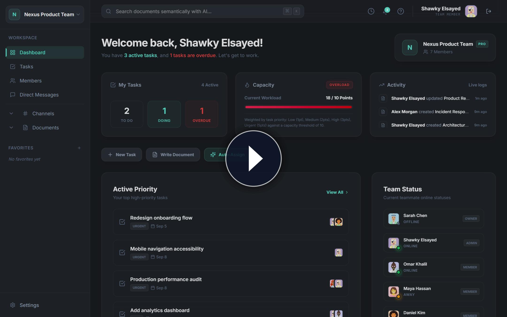
  </a>
  <br/>
  <strong><a href="https://drive.google.com/file/d/1tnb8HRKixMHOOI1DhhWuxmOhsymKqDql/view?usp=sharing">▶ Watch the 51-second Product Walkthrough on Google Drive (1080p HD) ↗</a></strong>
  &nbsp;·&nbsp;
  <a href="artifacts/demo/video/teamhub-demo-short.mp4"><strong>⚡ 30s Quick Cut (Local MP4)</strong></a>
</p>

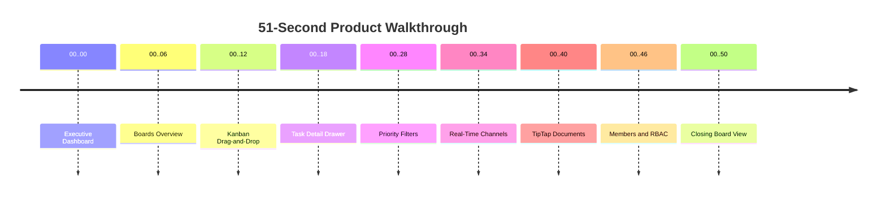

TeamHub is a containerized monorepo platform for agile engineering teams. It combines drag-and-drop Kanban boards with sub-50ms optimistic updates, Socket.IO real-time synchronization, a TipTap collaborative document editor, and a RAG-powered AI pipeline using LangGraph agents and pgvector semantic search.

---

## ✨ Product Experience

<table>
  <tr>
    <td align="center" width="50%">
      <strong>Kanban Sprint Board</strong><br/>
      <a href="docs/assets/readme/kanban-board.png">
        
      </a>
      <sub>Drag-and-drop task management with priorities, assignees, due dates, overdue alerts, filters, and real-time sync.</sub>
    </td>
    <td align="center" width="50%">
      <strong>Task Detail Drawer</strong><br/>
      <a href="docs/assets/readme/task-detail.png">
        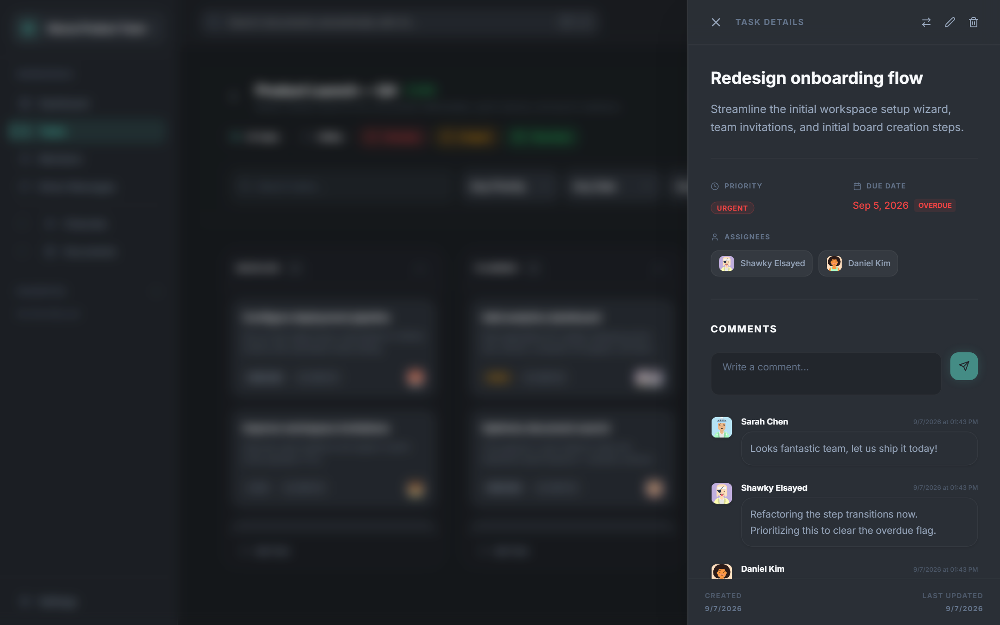
      </a>
      <sub>Sliding panel with live comments, priority selectors, multi-assignee clusters, and URL deep linking (<code>?task=uuid</code>).</sub>
    </td>
  </tr>
  <tr>
    <td align="center" width="50%">
      <strong>Real-Time Channels</strong><br/>
      <a href="docs/assets/readme/channels.png">
        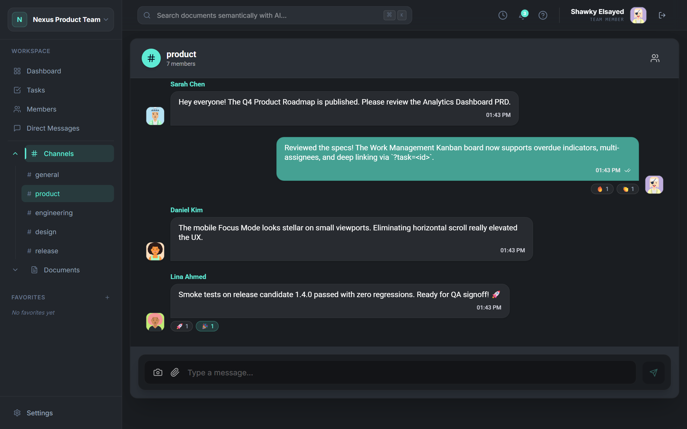
      </a>
      <sub>Socket.IO messaging with emoji reactions, typing indicators, code blocks, and optimistic delivery.</sub>
    </td>
    <td align="center" width="50%">
      <strong>Document Editor</strong><br/>
      <a href="docs/assets/readme/documents.png">
        
      </a>
      <sub>TipTap editor with headings, checklists, code blocks, debounced auto-save, and Markdown/PDF export.</sub>
    </td>
  </tr>
</table>

<p align="center">
  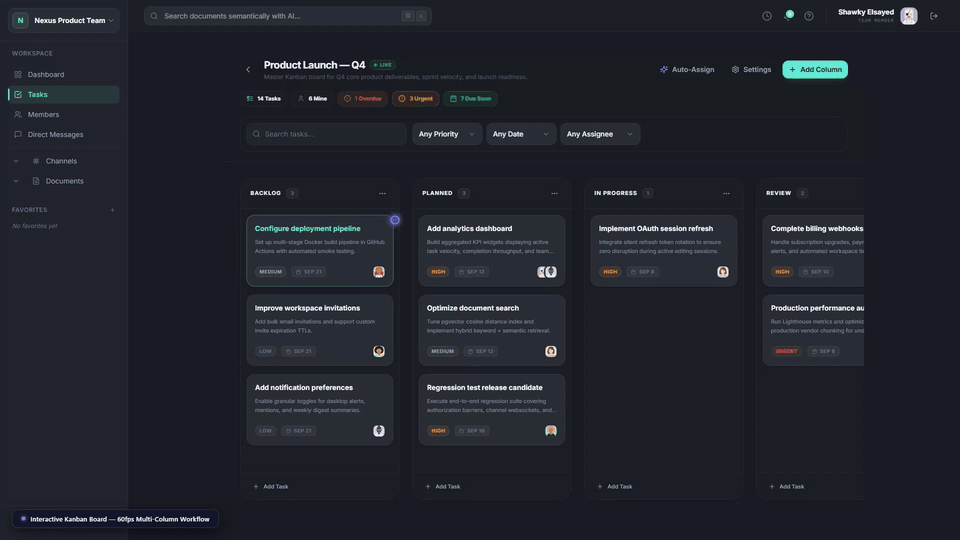
  <br/>
  <sub>Animated preview — Kanban drag-and-drop with optimistic column updates</sub>
</p>

---

## 🧩 Core Capabilities

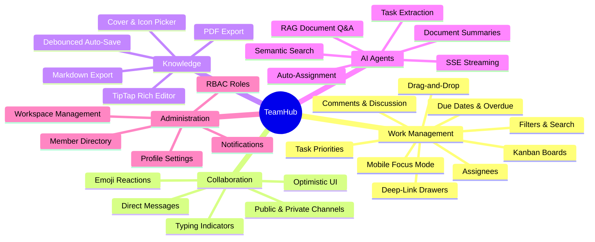

---

## 🏗 System Architecture

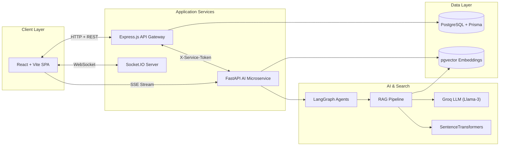

---

## 🔄 Real-Time Task Synchronization

How a task drag-and-drop propagates across concurrent sessions:

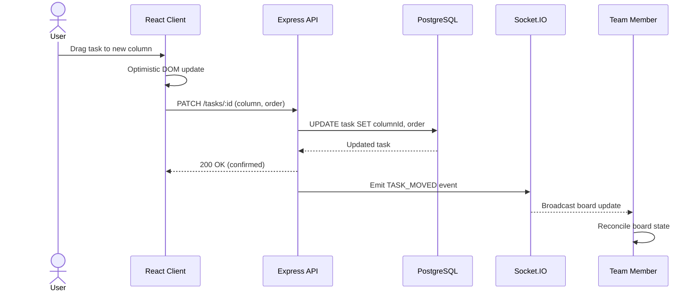

---

## 🎯 My Contribution — Work Management

**Shawky Elsayed** — Feature Architect 

I designed and implemented the complete Work Management system: the interactive Kanban board, task lifecycle engine, real-time synchronization, filtering system, and responsive mobile architecture.

### Component Architecture

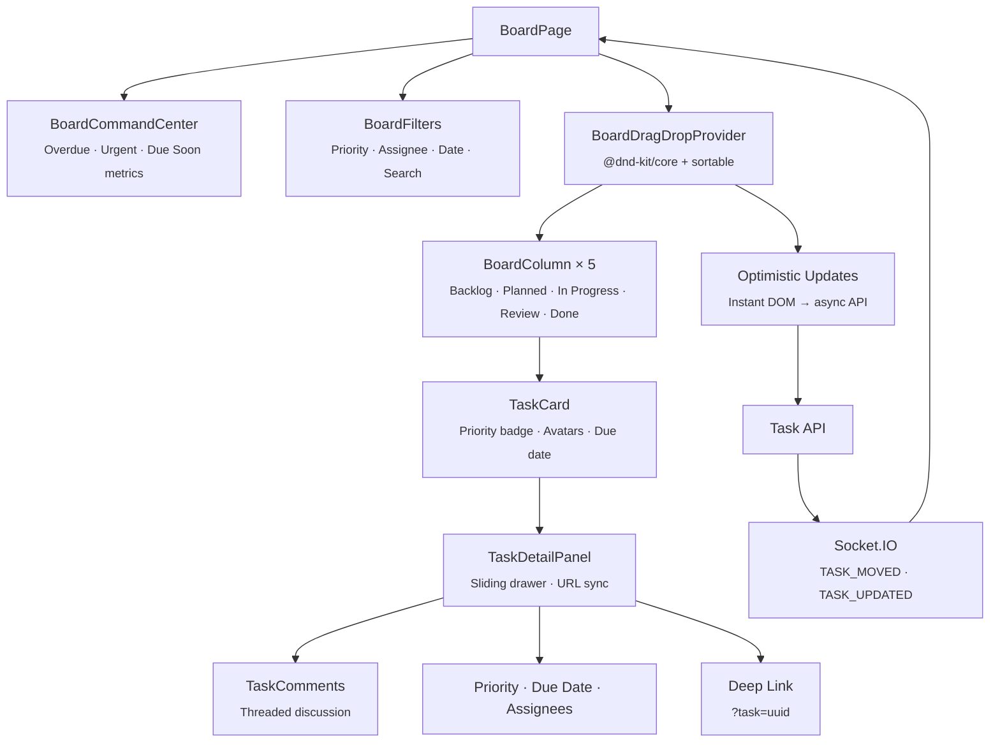

### Engineering Highlights

| Decision | Implementation | Impact |
| :--- | :--- | :--- |
| **Optimistic drag-and-drop** | `@dnd-kit/core` + `@dnd-kit/sortable` with TanStack Query cache mutation | Sub-50ms visual feedback; API sync runs asynchronously |
| **Deep-linked task drawer** | URL query parameter sync via React Router (`?task=uuid`) | Direct shareable links to specific task discussions |
| **Overdue state machine** | Client-side date arithmetic comparing `dueDate` against UTC clock | Automatic red badges on delayed tasks without manual toggles |
| **Mobile Focus Mode** | Single-column tabbed layout replacing horizontal scroll on ≤640px | Usable board experience on 390×844 mobile viewports |
| **Drag locks on filter** | Disabled `DndContext` sensors when `activeFilters.length > 0` | Prevents index corruption from reordering filtered subsets |
| **Real-time sync** | Socket.IO listeners (`TASK_MOVED`, `TASK_UPDATED`, `TASK_COMMENT_ADDED`) | Concurrent teammates see board changes instantly |

<p align="center">
  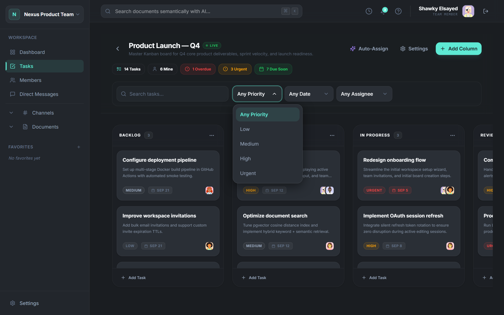
  
</p>

> 📄 Full technical documentation: [Work Management Docs](docs/Shawky%20Ahmad%20Shawky/)

---

## 🤖 AI & RAG Pipeline

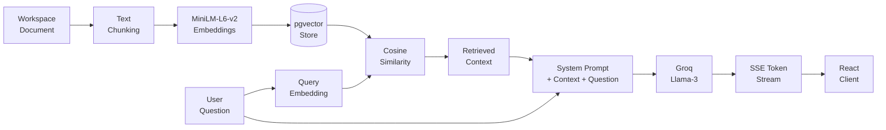

The AI microservice (FastAPI + LangGraph) provides:
- **Document Q&A**: Semantic retrieval over pgvector embeddings → Llama-3 grounded answer via SSE streaming
- **Summaries**: Short/Medium/Long document summaries generated from extracted text
- **Task extraction agent**: LangGraph workflow that parses document content into structured task drafts with human-in-the-loop clarification via `interrupt()`
- **Auto-assignment agent**: Calculates member workload points (Low: 1pt → Urgent: 5pts) and proposes balanced task distribution

---

## 🗄 Data Model

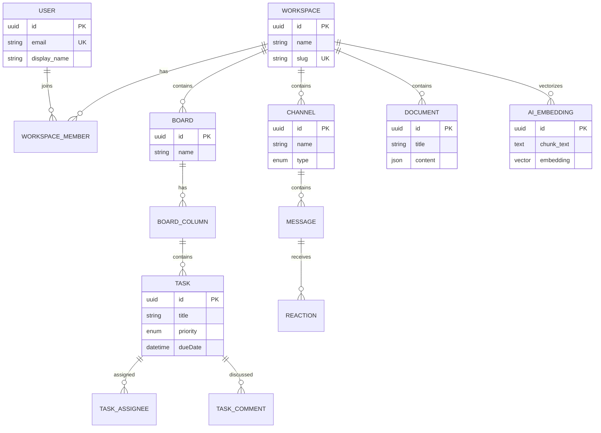

---

## 🛠 Tech Stack

| Layer | Technologies |
| :--- | :--- |
| **Frontend** | React 18, Vite 5, TypeScript, Tailwind CSS, TanStack Query v5, Zustand, TipTap, Lucide Icons |
| **Backend** | Node.js, Express.js, Prisma ORM v7, TypeScript |
| **Real-time** | Socket.IO v4 (namespaced rooms, typed events) |
| **AI & Search** | FastAPI (Python 3.11), LangGraph, LangChain, Groq Cloud API (Llama-3) |
| **Embeddings** | HuggingFace SentenceTransformers (`all-MiniLM-L6-v2`), PostgreSQL `pgvector` |
| **Database** | PostgreSQL 16, `pgvector` extension |
| **Infrastructure** | Docker Compose, Nginx, Turborepo monorepo |

---

## 📸 Product Gallery

<table>
  <tr>
    <td align="center"><strong>Executive Dashboard</strong><br/>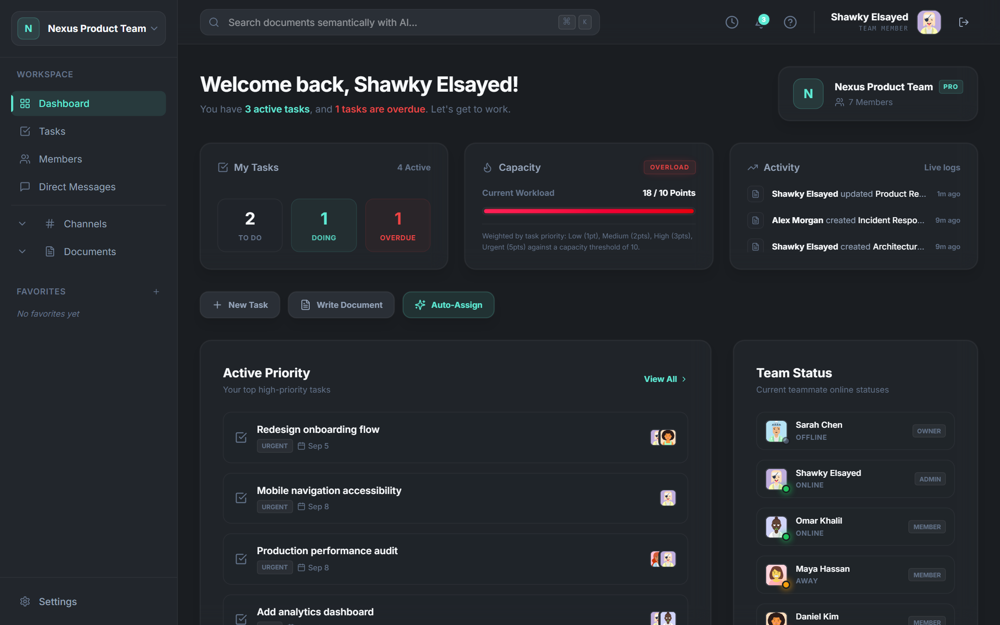</td>
    <td align="center"><strong>Kanban Board</strong><br/></td>
  </tr>
  <tr>
    <td align="center"><strong>Task Detail & Comments</strong><br/></td>
    <td align="center"><strong>Real-Time Channels</strong><br/></td>
  </tr>
  <tr>
    <td align="center"><strong>Document Editor & AI</strong><br/>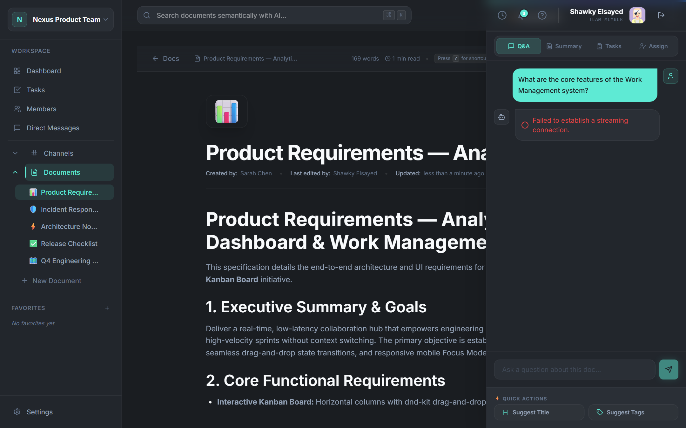</td>
    <td align="center"><strong>Members & RBAC</strong><br/>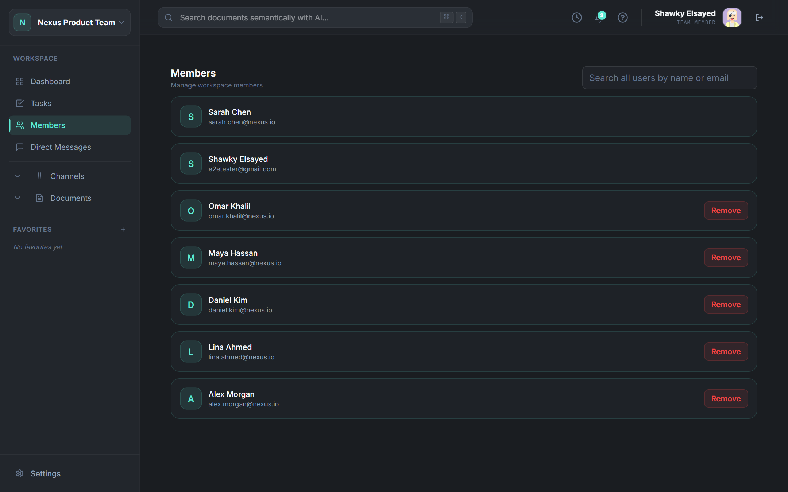</td>
  </tr>
  <tr>
    <td align="center"><strong>Board Filters</strong><br/></td>
    <td align="center"><strong>Mobile Focus Mode</strong><br/>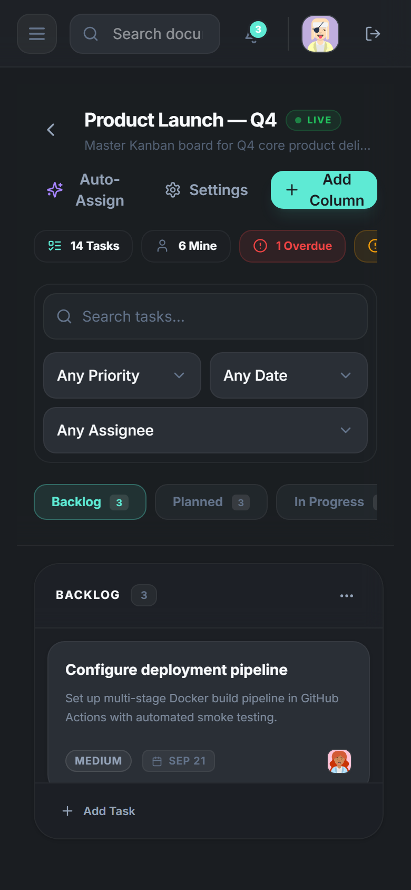</td>
  </tr>
</table>

---

## 🚀 Getting Started

<details>
<summary><strong>🐳 Docker (Recommended — no setup required)</strong></summary>

```bash
git clone https://github.com/mazen568/teamhub.git
cd teamhub
docker compose up
```

| Service | URL |
| :--- | :--- |
| Frontend | http://localhost:5173 |
| API Gateway | http://localhost:3000 |
| AI Service | http://localhost:8000 |

**Default login**: `e2etester@gmail.com` / `password123`

</details>

<details>
<summary><strong>🏃 Local Development (Node.js + Python)</strong></summary>

**Prerequisites**: Node.js 18+, pnpm 9+, Python 3.11+, PostgreSQL with `pgvector`

```bash
# Install dependencies
pnpm install

# Configure environment
cp .env.example .env
cp apps/api/.env.example apps/api/.env
cp apps/ai/.env.example apps/ai/.env

# Setup Python AI service
cd apps/ai && python -m venv .venv && .venv/Scripts/Activate.ps1 && pip install -e ".[dev]" && cd ../..

# Run migrations
pnpm prisma:migrate
cd apps/ai && alembic upgrade head && cd ../..

# Start all services
pnpm dev
```

| Service | URL |
| :--- | :--- |
| Frontend | http://localhost:5173 |
| API Gateway | http://localhost:3000 |
| AI Docs | http://localhost:8000/docs |

</details>

---

## 👥 Team & Credits

| Member | Area | Key Contributions |
| :--- | :--- | :--- |
| **Mazen Raafat** | Auth & Workspace | JWT auth with httpOnly refresh rotation, workspace CRUD, Zod validation schemas |
| **Hassan Muhammad** | Members & Channels | Member directory with RBAC, channel management, DM transactions, search integration |
| **Moamen Soltan** | Real-Time Chat | WebSocket message delivery, cursor-based pagination, typing indicators, chat bubble alignment |
| **Shawky Elsayed** | **Work Management** | **Kanban board, drag-and-drop, task lifecycle, deep-linked drawer, filters, overdue states, mobile Focus Mode, real-time board sync** |
| **Hassan Abdelhamed** | Documents, AI & Assets | TipTap editor, Markdown/PDF export, Cloudinary uploads, notifications, RAG engine, LangGraph agents |

---

## 📚 Documentation

| Document | Description |
| :--- | :--- |
| [Featured Demo Video](https://drive.google.com/file/d/1tnb8HRKixMHOOI1DhhWuxmOhsymKqDql/view?usp=sharing) | Full 51-second 1080p HD product walkthrough stream on Google Drive |
| [Work Management — Technical Docs](docs/Shawky%20Ahmad%20Shawky/) | Feature documentation, API flows, UI/UX decisions, validation & QA |
| [Demo Manifest](artifacts/demo/manifests/DEMO_MANIFEST.md) | Complete demo environment specification, test accounts, entity registry |
| [Hero Screenshots Breakdown](artifacts/demo/manifests/HERO_SCREENSHOTS.md) | Technical analysis of each captured view |
